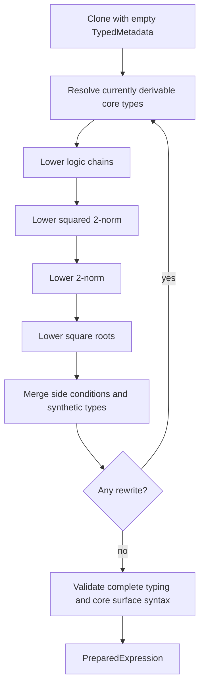
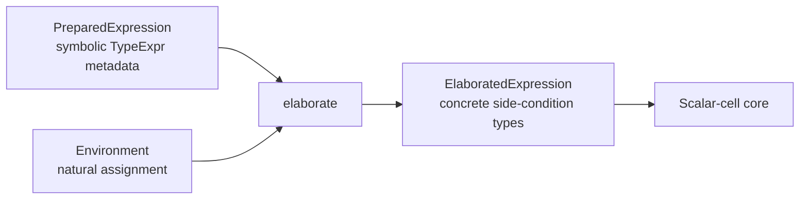
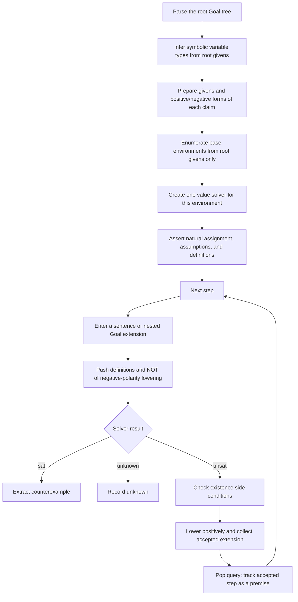

# Pipeline Overview

The checker has two distinct inference phases:

1. **Symbolic preparation**, which is independent of concrete dimensions.
2. **Concrete elaboration**, which runs after a natural-number environment has
   been selected.

Only after both phases does the checker construct value-level Z3 expressions.
This separation lets preprocessing preserve symbolic matrix and sequence sizes,
while keeping environment-dependent expansion out of the Z3 core.


## 1. Parsing

Markdown workflows parse list items containing TeX through `from_tex` into
`Expr<()>`. At this point:

- the tree retains the user's surface syntax;
- context-dependent constants such as `I`, `e_i`, and `\mathbb{0}` already have
  distinct `ImplicitDimension` nonces;
- there is no type annotation on an expression node;
- no Z3 objects have been constructed.

The Markdown modules differ mainly in their section structure:

- `find_model` parses `Assumptions`, `Sentences`, and `Conclusion`;
- `find_model_given_environment` parses `Environment`, `Sentences`, and
  `Conclusion`;
- `validate_argument` parses one recursive root goal using `Given:`, `WTS`, and
  ordered sentence or subgoal items. A goal may currently use the tactic
  `by induction on $n$`.

## 2. Symbolic Variable Types

`infer_symbolic_type_environment` builds a `SymbolicTypeEnvironment`:

```text
Variable -> TypeExpr<()>
```

It uses explicit type memberships from the assumptions first, then natural
number usage and name-based guesses. For example, an untyped uppercase `A` is
assigned a symbolic matrix type whose dimensions are expressions such as
`A_{rows}` and `A_{cols}`.

This map describes variable leaves. It does not contain concrete dimensions or
the result type of every AST node. For argument validation, only assumptions are
used to build this base variable-type environment; a step does not get to change
the class of user structures being tested.

## 3. Symbolic Preparation

`prepare_expression` converts one surface expression into a
`PreparedExpression`:

```rust
pub struct PreparedExpression {
    pub expression: Expr<TypedMetadata>,
    pub side_conditions: Vec<SideCondition<TypedMetadata, TypeExpr<()>>>,
    pub context: VisitContext,
}
```

`TypedMetadata` contains `Option<TypeExpr<()>>`. A resolved annotation is the
symbolic value type of that exact node. It may contain symbolic dimensions; it
is not a concrete `Type` and is not a cache of environment data.

Preparation runs a fixpoint over the main expression and every assertion in its
side-condition forest:



Typing is monotone. Existing annotations are retained, while newly generated
nodes begin unresolved and are typed on a later iteration. The final
no-rewrite iteration therefore leaves authoritative metadata on the entire
prepared forest.

`OperatorTypeRules::core()` computes parent types from typed children. Structural
forms such as literals, variables, matrices, chains, and sequence binders are
handled directly by `TypeResolver`.

### Logical polarity

`VisitContext.logical_polarity` records how the expression will be used in a
Boolean context. It is propagated top-down by mutable visitors and retained in
`PreparedExpression.context` as provenance.

Preparation does not negate an expression. Argument validation prepares each
step twice:

- positive preparation for adding an accepted step as a premise;
- negative-polarity preparation for a counterexample query, after which the
  caller explicitly negates the lowered Boolean.

### Side conditions

Desugaring may introduce a synthetic variable and associated obligations. A
symbolic `SideCondition` contains:

- the internal introduced variable;
- a user-facing display name;
- its symbolic `TypeExpr<()>`;
- defining assertions;
- an existence classification: `Guaranteed`, `Checkable`, or `Assumed`.

For example, square-root preprocessing replaces a root with a deterministic
synthetic variable and records the equation defining that variable. Synthetic
variables are internal and are not included when user models are extracted.

## 4. Dimension Constraints and Environment Enumeration

`extract_prepared_environment_iterator` compiles symbolic types and prepared
expressions into an incremental integer Z3 solver. It then runs the ordered,
read-only dimension-constraint visitors:

1. operator compatibility;
2. block-matrix compatibility;
3. sequence range and index compatibility.

These visitors read `TypedMetadata`; they do not infer result types recursively.
They assert constraints through one `DimensionConstraintBuilder`. There is no
separate dimension-constraint IR.

Top-level memberships and natural comparisons are handled explicitly in
addition to the recursive visitors. Generated side-condition definitions are
also included because they may imply dimensions, such as the squareness needed
for a matrix root.

The builder has two traversal modes:

- **Permanent**: all constraints from assumptions and generated definitions are
  asserted.
- **Contextual**: constraints are retained only when they depend on an implicit
  nonce dimension.

This prevents ordinary sentences from narrowing user matrix dimensions while
still allowing a sentence-local `I` or `\mathbb{0}` to acquire dimensions.

### Concrete environments

An `Environment` contains only:

```rust
pub struct Environment {
    pub natural_assignment: HashMap<NaturalParameter, u64>,
}
```

`NaturalParameter` is either a user `Variable` or an `ImplicitDimension` nonce.
Concrete variable types are not duplicated in the environment: they are obtained
by evaluating the symbolic `TypeExpr` stored in metadata against this assignment.
`Environment::evaluate_natural` delegates expression evaluation to the shared Z3
natural-arithmetic lowering.

The iterator:

- assigns all free natural parameters, excluding lexical sequence binders;
- enforces positivity for structural dimensions and sequence lengths;
- bounds parameters and resulting structural dimensions by `max_dimension`;
- enumerates assignments by increasing sum;
- blocks each complete natural assignment after yielding it;
- separately checks whether any admissible assignment exists beyond the bound.

That last query distinguishes bounded results such as "likely" or "unsat up to
dimension 2" from exhaustive results such as "verified" or "unsat".

## 5. Post-Enumeration Concrete Elaboration

`elaborate(environment, prepared)` deep-clones the complete prepared forest and
specializes it for one selected environment. Symbolic metadata remains the
source of type information; dimensions are evaluated on demand through the
environment. Type resolution is not rerun.

The elaboration fixpoint runs these fallible mutable visitors:

1. **Membership elaboration** checks concrete type compatibility and lowers
   natural membership to nonnegativity.
2. **Sequence elaboration** evaluates ranges and indices, substitutes lexical
   indices, unrolls exactly the selected terms, and materializes indexed values.
3. **Concrete-leaf elaboration** materializes matrix variables, identity and zero
   matrices, standard basis vectors, and implicit dimensions.
4. **Matrix elaboration** flattens block matrices and expands matrix operations,
   casts, powers, transpose, trace, determinant, and matrix comparisons.

The result is an `ElaboratedExpression`. Its side conditions now carry concrete
`Type` values rather than symbolic `TypeExpr`s.



Matrix-valued results remain possible, but only as flat row-major matrices of
scalar expressions. No matrix arithmetic is allowed to reach core Z3 lowering.
Residual sequence syntax, implicit constants, casts, powers, block matrices, or
matrix operators produce `ElaborationError` before Z3 construction.

## 6. Z3 Construction and Side Conditions

`to_z3(environment, prepared)` is the standard boundary. It calls `elaborate`
and then lowers the scalar-cell core into:

```rust
pub struct ToZ3Result {
    pub expression: Z3Object,
    pub side_conditions: Vec<LoweredSideCondition>,
}
```

Core lowering supports scalar literals and variables, scalar arithmetic,
Boolean finite operations, scalar comparisons, simple implication, and flat
matrix values. Integer/real promotion happens here.

Callers must positively assert every defining assertion in the returned side
conditions. Existence is handled separately:

- `Guaranteed` needs no warning query;
- `Checkable` supplies assertions whose satisfiability demonstrates possible
  undefinedness;
- `Assumed` produces an unchecked-existence warning.

## 7. Argument Validation

Argument validation is the most complete consumer of the pipeline. The root
goal's givens determine base environments. Sentences and nested goals are then
challenged recursively using incremental value-level solver scopes.



### Base and step-local dimensions

Only root givens constrain base environment enumeration. A nested goal fixes the
parent assignment, extends symbolic types with variables first introduced by
its own givens, and enumerates its local natural parameters. A sentence fixes
the current assignment and enumerates only contextual parameters needed to make
that sentence dimensionally meaningful.

If no sentence extension exists, that sentence is dimensionally invalid. If a
nested goal's givens have no feasible extension, the goal is reported as
vacuous. Neither case removes an outer environment from the counterexample
search.

### Incremental value solving

For each base environment, root givens are asserted once and tracked for unsat
cores. Goal bodies use pushed scopes. Validation processes body items in order,
asserting only successful claims, then checks the goal conclusion from the facts
that survived. A failed child remains marked locally and does not prevent an
independently valid conclusion from succeeding.

For each claim-local extension, validation:

1. lowers the negative-polarity prepared form;
2. pushes a solver scope;
3. asserts its defining side conditions and the explicit negation of the step;
4. checks for a counterexample;
5. pops the scope;
6. if no counterexample exists, checks existence warnings and lowers the step
   positively;
7. after all extensions succeed, tracks the accepted positive sentence as a
   premise for later siblings.

A completed subgoal exports only its conceptual conclusion. A plain `WTS C`
exports `C`; `Given G; WTS C` exports `G => C`. Results that introduce local
variables are retained as scoped statements for future structural matching but
are not asserted as quantified Z3 formulas. Internal proof steps never escape
their goal.

Natural-number induction uses this structural matching directly. For
`WTS P(n) by induction on n`, validation first finds the lowest admissible
starting value `s` from the goal's natural and dimensional constraints. This
query requires the conclusion to be well-typed but does not assert its truth.
Validated direct child goals must then establish `P(s)` and
`Given forall G(n), P(n); G(n + 1); WTS P(n + 1)`, where `G` denotes the
parent goal's givens. The universal induction hypothesis is retained as a
scoped structural fact and is never asserted to Z3. The step's `n` is instead
a fresh local natural parameter, constrained by `n >= s` and enumerated through
concrete environments. Complete obligations establish the parent goal;
otherwise the complete missing scoped statements are reported and ordinary
bounded validation of the parent claim continues.

An unsat core supplies the assumptions and previous accepted steps shown as
supporting facts. A discovered counterexample has priority over tentative
successes from other environments. Validation may stop once every step has a
counterexample.

If every admissible environment was searched, success is rendered as
`verified`; otherwise it is `likely` up to the configured dimension bound.

## 8. Other Workflows

### `find_model`

The flagship model finder shares symbolic typing, preparation, environment
enumeration, elaboration, and Z3 lowering with argument validation.

- Assumptions determine ordinary environment constraints.
- Sentence expressions are passed in contextual mode, so their ordinary shape
  constraints do not narrow user dimensions. Constraints involving sentence-local
  implicit nonces still apply, and generated side-condition definitions are
  permanent typing obligations.
- For each environment, assumptions and sentences are asserted together in a
  fresh value solver.
- The first satisfiable environment yields a user-variable model.
- Exhaustive failure yields `Unsat`; bounded failure yields
  `UnsatUpToDimension(max_dimension)`.

### `find_model_given_environment`

This workflow receives explicit `Environment` declarations in Markdown instead
of enumerating environments. It:

1. infers symbolic variable types from those declarations;
2. extracts direct natural assignments from declaration equalities;
3. prepares declarations and sentences;
4. elaborates and solves them under that one environment.

Its Markdown environment remains expression-valued, but the runtime
`Environment` still contains only the natural assignment.

### Shared model extraction

Model extraction iterates over the user inventory in
`SymbolicTypeEnvironment`, concretizes each symbolic type using the selected
environment, and evaluates the corresponding lowered Z3 constants. Sequence
elements are prepared and elaborated through the normal indexed-expression path.
Synthetic variables and implicit dimensions are deliberately excluded from
presented models.
